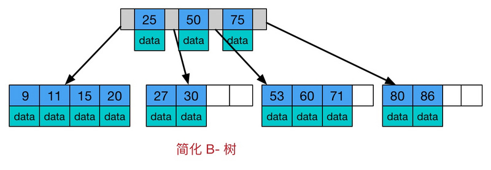

# B Tree & B+Tree

B树, B+树 是一种自平衡的树，能够保持数据有序. 这种数据结构能够让查找数据, 顺序访问, 插入数据及删除的动作, 都在对数时间内完成. 适用于读写相对大的数据块的存储系统, 例如磁盘. 可以用来建立 Database 的 index.

## B Tree

B树的特点:

1. 所有键值分布在整个树中
2. 任何关键字出现且只出现在一个节点中
3. 搜索有可能在非叶子节点结束
4. 在关键字全集内做一次查找，性能逼近二分查找算法

## B+ Tree

从图中也可以看到，B+树与B树的不同在于：

1. 所有关键字存储在叶子节点，非叶子节点不存储真正的data
2. 为所有叶子节点增加了一个链指针

## 资料





