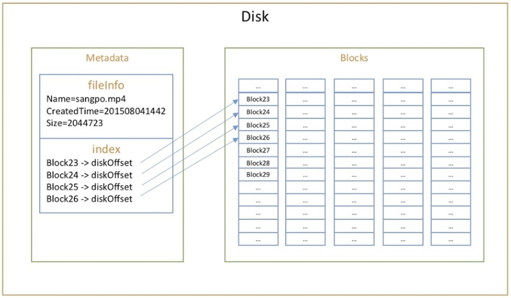
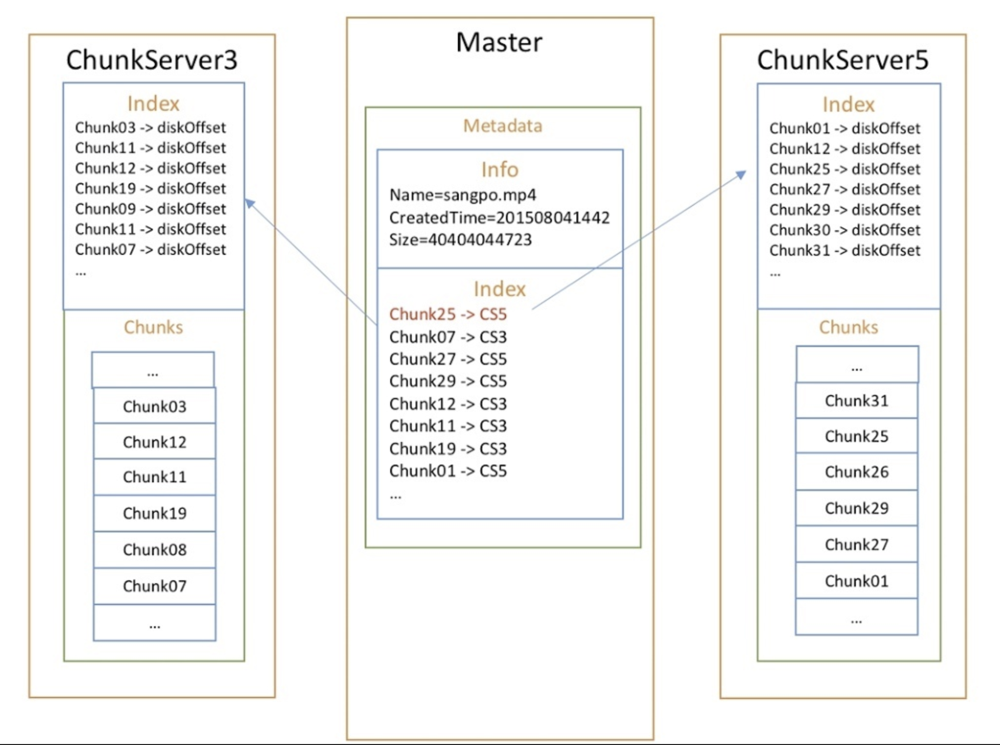
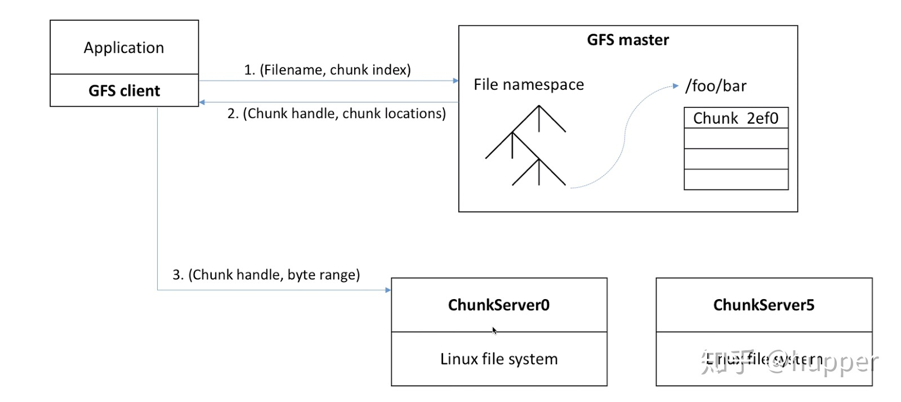
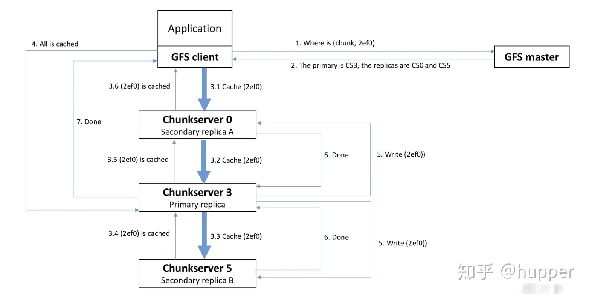

# GFS

* [GFS Structure](gfs.md#gfs-structure)
* [Read Data](gfs.md#read-data)
* [Write Data](gfs.md#write-data)
* [Failure and Recover](gfs.md#failure-and-recover-key)

## GFS Structure

### Basic OS File System

#### Directory file 

* Located at position 0
* Store every file's metadata \(create time, size, blocks number\)

#### User data

* Store in **blocks** \(4KB\)

### **Google File System**

#### **Master**

* Store metadata
* For every file , store chuck numbers and which chunk \(chunk handler\) located at which chunkserver

#### Chunkserver

* File ****stores in chunks \(64MB\)
* Chunkserver Store every chunk's offset at local disk
* 为了提高可靠性，每个chunk都是多副本存储在多个chunkserver上，默认情况下是三副本。

## Read Data

1. client通过文件名、chunk index向master查询chunk的分布 
2. master回复chunk handler以及副本分布 \(**Chunk List**\)
3. client从chunk的分布信息中查找距离自己最新的chunkserver，并发送查询请求。查询请求中包括chunk hander以及byte range。后续对相同chunk的查询不需要再次向master查询meta信息，因为client已经缓存了meta信息。

## Write Data

1. client向master查询chunk的primary所在的chunkserver以及其他副本的分布，如果没有primary，master会选择一个作为该chunk的primary
2. master回复client primary和其他副本的分布信息。client会cache返回的metadata 
3. client将数据发送所有的副本。client可以以任意顺序执行。每个chunkserser都会在内存的LRUbuffer中记录数据。 
4. 当所有的副本都返回已经接收数据成功后，client会向primary发送一个写请求。
5. Primary replica会开始往自己的硬盘上写，同时通知两个Replica也开始往自己的硬盘上写。
6. primary接收到其他副本回复的数据操作完成 
7. primary返回client结果。期间发生的所有错误都会报给client。

## Failure and Recover \(key\)

### Discover the data failure in a chunk?

* **Check Sum** \(MD5, SHA1, SHA256 and SHA512\)
* 一个chunk被分解为多个64KB的块，每个块有对应32位的checksum。checksum被保存在内存中，并用利用日志持久化保存，与用户数据是隔离的，当然，这里的内存和持久化都是在**chunkserver**上。当chunkserver收到读数据请求的时候，会比对文件数据与对应的checksum，如果发现不匹配，会告知client，client从其他的读取；同时，也会告知master，master选择新的chunkserver来restore这个损坏的chunk

### Avoid the failure a chunk?

* **Replica**
* 当Master发现了某个chunk的冗余副本数目达不到要求时（比如某个chunkserver宕掉），会为这个chunk补充新的副本；当有新的chunkserver添加到系统中时，也会进行副本迁移－－将chunk为负载较高的chunkserver迁移到负载低的chunkserver上，达到动态负载均衡的效果。
* 当需要选择一个chunkserver来持久化某个chunk时，会考虑以下因素：
  * 选择磁盘利用率降低的chunkserver；
  * 不希望一个chunkserver在短时间创建大量chunk；
  * chunk要**跨机架** \(put replica each in _**different rack**_**\)**

### Recover the chunk failure?

* **Ask master**
* CS4 has chunk failure \(Checksum not match\) -&gt; ask master -&gt; know that CS5 and CS3 \(replicas\) has the data
* CS4 check with CS5  -&gt; C restore from CS5

### Discover the failure of the Chunk Server?

* **Heart Beat**
* Master会记录他们活着的时间，比如5号说我活着，然后他就记录下活着的时间，3号和2号说我也活着，他也分别记录了时间，但是4号却很久不回来，这说明他已经死了，这就是所谓的心跳。如果Chunk Server很长时间内没有发生心跳的话，并且排除一些故障，就可以判断他已经死了。

### Solve the failure of writing Chunk Server?

* **Retry**

### Master 如何应对热点?

* 我们只要加一个热点平衡进程就行，记录每个数据块访问的热度以及每个服务器的剩余空间、带宽的数量。如果发现一个东西成为热点时该怎么办？把他复制到更多的Chunk Server上就行了，并基于每个服务器的带宽和硬盘利用率来进行选择







\*\*\*\*

\*\*\*\*

\*\*\*\*

