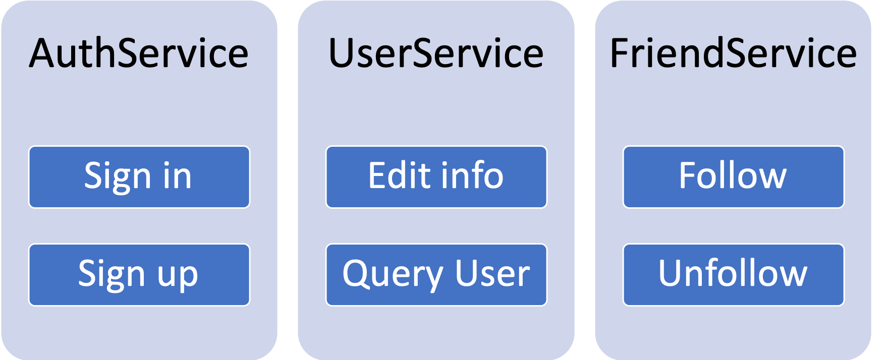
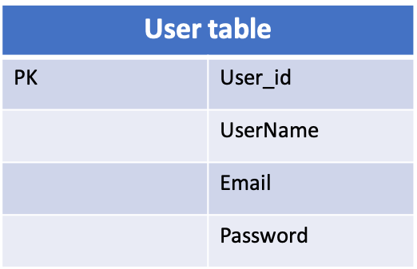

# User System


* How to find Mutual friend?
* Linkedin 六度关系?


## Scenario

### Feature

* Sign in
* Sign up
* Edit user info
* Query user
* Follow
* Unfollow

### QPS

* DAU ?
  * 100M
* QPS for Query User \(100 times per day per user\):
  * 100M \* 100 /86400 ~ 100k
  * **Peak ~ 300k**
* QPS for other features\(0.1 times per day per user\):
  * 100M \* 0.1/86400 ~ 100
  * Peak ~ 300

## Service

                                                                                  

## Storage

### Authentication Service

#### Routine

* Client log in, server create Session.
* Server return Session Key to client.
* Every time client send request to server, it should include Session Key in its cookie.
* Server to verify the Session Key.

#### Database select

* **Cache**
  * Since session info is  not that important, lack of durability is not an issue.
  * We can add a DB if need more durability.


* Cache can only accelerate **read**
* Cache can be set a **ttl** to resolve consistent issue \(dirty cache\)
* Cache aside  / Cache through: Radis


#### Session Table Schema

                                                          

### Friendship Service

#### Database select

* **NoSQL \(Cassandra\)**
  * We only store key-value, simple to query, don't need complex index.
  * High performance.
  * Easy to scale.

#### Friendship Table Schema

                                                           

* The above is the 2-way friendship, what about 1-way frendship?
  * create 2 tables : Following table and Follower table
* _**How to find Mutual friend?**_
  * _**???**_
* _**Linkedin 六度关系?**_
  * _**???**_

### User Service

#### Database select

* **SQL**
  * Multi\_index
  * User info is so important, need trust and confident.

#### User Table Schema

                                                            

* How to use NoSQL to store User Table?
  * Create multiple table to search by email username .....

## Scale

### How to shard User Table?

* By User\_id, because it can be use as foreign key.
* What about log in, UserName will be used to search?
  * create another table to store UserName -&gt; User\_id relation.
* How to maintain unique User\_id?
  * Use a separate web server to create UUID when sign up.

### How to shard Friendship Table?

* 2-way: User\_id
* 1-way: User\_id with 2 tables \(following, follower\)
* Add more replica if some shard too hot!!

### How to shard Session Table?

* By Session\_Key

