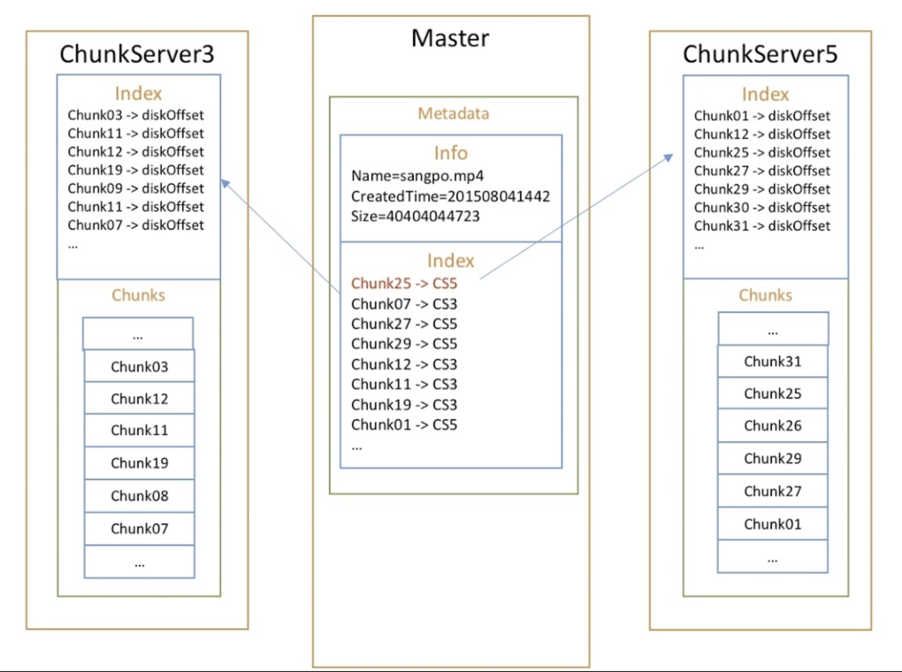

# GFS

## GFS Structure

### Basic OS File System

#### Directory file 

* Located at position 0
* Store every file's metadata \(create time, size, blocks number\)

#### User data

* Store in **blocks** \(4KB\)

### **Google File System**

#### **Mater**

* Store metadata
* For every file , store chuck numbers and which chunk \(chunk handler\) located at which chunkserver

#### Chunkserver

* File ****stores in chunks \(64MB\)
* Chunkserver Store every chunk's offset at local disk
* 为了提高可靠性，每个chunk都是多副本存储在多个chunkserver上，默认情况下是三副本。

所以说，架构其实是一模一样的，只不过把索引信息放到了大的Master上，将数据分布到不同机器上，我们只需在偏移量前面记录机器的偏移量，就可以解决同样的问题

## Read Data

1. client根据文件名、byte offset以及chunk size计算出要读取的文件的chunk index 
2. client通过文件名、chunk index向master查询chunk的分布 
3. master回复chunk handler以及副本分布 
4. client 缓存chunk的meta信息，key由文件名和chunk index组成 
5. client从chunk的分布信息中查找距离自己最新的chunkserver，并发送查询请求。查询请求中包括chunk hander以及byte range。后续对相同chunk的查询不需要再次向master查询meta信息，因为client已经缓存了meta信息。

## Write Data

1. client向master查询chunk的primary所在的chunkserver以及其他副本的分布，如果没有primary，master会选择一个作为该chunk的primary
2. master回复client primary和其他副本的分布信息。client会cache返回的metadata 
3. client将数据发送所有的副本。client可以以任意顺序执行。每个chunkserser都会在内存的LRUbuffer中记录数据。 
4. 当所有的副本都返回已经接收数据成功后，client会向primary发送一个写请求。
5. Primary replica会开始往自己的硬盘上写，同时通知两个Replica也开始往自己的硬盘上写。
6. primary接收到其他副本回复的数据操作完成 
7. primary返回client结果。期间发生的所有错误都会报给client。





\*\*\*\*

\*\*\*\*

\*\*\*\*

