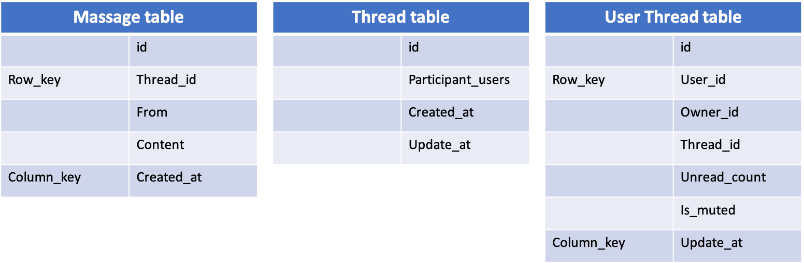

# Design Chat App


* 多机登陆
* 在线状态
* 用户正在输入


## Scenario

### Feature

* **P2P chat**
* **Group chat**
* Contect
* Sign in/up \(user system\)

### QPS

* WeChat has 45B messages per day.
* QPS: 45B / 86400 ~ 520K
* Peak: 1.5M
* Storage 30Byte \* 45B = 1.3T per day

## Service

* Message Service
* Realtime Service \(Push Notification\)

## Storage

### Message Service

**Schema**

* Massage table
  * **NoSQL**:
    * Optimize for write
    * Msgs are append only, no need for modifications.
    * No complex index.
  * Row\_key : Thread\_id
  * Column\_key: Created\_at
* Thread table:
  * **SQL or NoSQL**: 
    * No Complex index
* User Thread  table:
  * SQL or **NoSQL**: 
    * No Complex index
  * Row\_key: User\_id
  * Column\_key: Updated\_at \(Since we need to update the data happend after last fetch\)

#### **How to get all msg in a Thread?**

* **SELECT** from Massage table
* **WHERE** thread\_id = xxxxx
* **ORDER** by Creat\_at
* **LIMIT** 20

#### **What id user has personal setting for each thread?**

* Add User\_thread table

#### **How to get Thread\_id if front end only give participant user id?**

* Add field **Participants\_hash\_code** to Thread table
* Participants\_hash\_code = Hash\(sorted\(participants\_user\_ids\)\)
* We can use UUID as Hash Function to prevent hash collision.
* If using **NoSQL**, we need add another table to search from **Participants\_hash\_code** to Thread\_id.

### Realtime Service

* Android GCM and IOS APNS
  * Can not support web client
* Socket
  * Build connection
    * Client request web server for push server IP.
    * Client connect with push server.
  * Send MSG
    * User A send MSG to web server.
    * Web server store the MSG, and push to push server.
    * push server send MSG to User B.
    * User B receive the MSG.
* Backup, what if push server down
  * Client poll for update every 10s.

## Scale

What about Group Chat \(500 people\)?

* Only few people online.
* Web server send request to push server 500 times would be a waste.

### Channel Service

* 增加一个Channel Service（频道服务） 
* 为每个聊天的Thread增加一个Channel信息 
* 对于较大群，在线用户先需要订阅到对应的 Channel 上
  * 用户上线时，Web Server \(message service\) 找到用户所属的频道（群），并通知 Channel Service 完成订阅 
  * Channel就知道哪些频道里有哪些用户还活着 
  * 用户如果断线了，Push Service 会知道用户掉线了，通知 Channel Service 从所属的频道里移除
* Message Service 收到用户发的信息之后
  * 找到对应的channel 
  * 把发消息的请求发送给 Channel Service 
  * 原来发500条消息变成发1条消息
* Channel Service 找到当前在线的用户
  * 然后发给 Push Service 把消息 Push 出去

