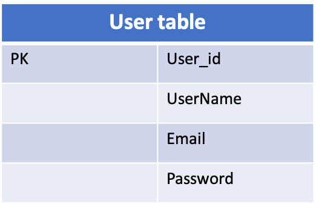
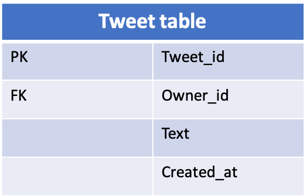
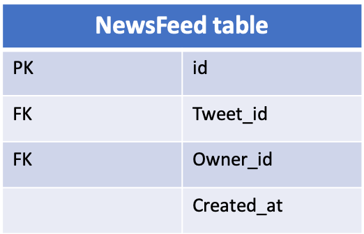

# NewsFeed

## Scenario

### Feature

* Time line
* News feed
* post 

### QPS

* DAU
  * 100M
* Read QPS 
  * 100M \* 100 / 86400 ~ 100k
  * Peak Read QPS 300k
* Write QPS 3k

## Service

* Tweet service
  * Timeline
  * Newsfeed
  * Post

## Storage

### Pull model

**schema**

                                   

                                                             

**Post tweet:**

* add 1 tow to tweet table

**News Feed:**

* Query Friendship Table to find user's followings.
* Query Tweet Table find every following's 100 most tweet
* K-merge sort, send back to user.

### Push model

**+  Newsfeed Table**

                                                               

**Post tweet:**

* Query Friendship Table, find followers
* Add rows to NewsFeed Table, owner is the followers.

**News feed:**

* Query NewsFeed Table, find their feeded tweet.

### Pull VS. Push

**Pull:** 

* Pro: 
  * Post tweet  =&gt; 1次DB write
* Con: 
  * News Feed =&gt; N次DB Reads非常慢 且发生在用户获得News Feed的请求过程中

**Push:** 

* Pro: 
  * News Feed =&gt; 1次DB Read
* Con: 
  * Post tweet  =&gt; N个粉丝，需要N次DB Writes, followers的数目可能很大
  * 好处是可以用异步任务在后台执行 \(Async Tasks Server\)，无需用户等待

## Scale

